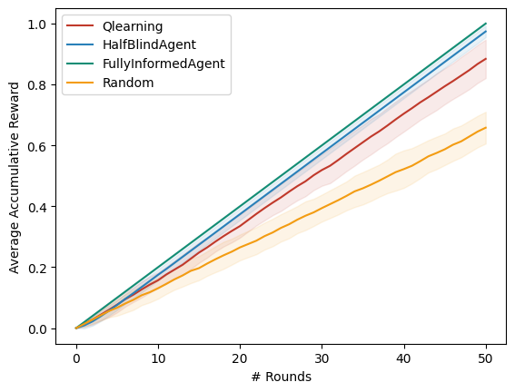

# Playing against nature

  

Código para replicar el trabajo de [Playing against Nature: causal discovery for decision making under uncertainty](https://arxiv.org/pdf/1807.01268.pdf  "Playing against nature")

 
## Instalación y ejecución

Instalar los módulos requeridos para ejecutar los programas.

    pip install -r requisitos.txt
 
 Para ejecutar los experimentos de acuerdo con la configuración experimental del artículo original ejecutar el programa `experiments.py`.

Para cambiar la configuración del modelo y otros parámetros,  los agentes reciben un archivo de configuración
en formato de `json`, con la siguiente estructura.

    {
	    "digrap": [
		    [
			    "variable1",
			    "variable2"
		    ]
		    [
			    "variablei",
			    "variablej"
		    ]
	    ],
	    "cpdtables" : [
		    "variable" : "variablei",
		    "variable_card" : # de valores de la variable,
		    "values": [
			    probvalor1,
			    probvalorn,
		    ]
		    "evidence" : [
			    "padre1",
			    "padren"
		    ]
		    "evidence_card" : [
			    # de valores para padre 1, # de valores padre n
		    ]
	    ]
	    "target": "variabletarget",
	    "nature_variables" : [
		    "variable i no intervenible que la naturaleza modifica"
	    ],
	    "interventions" : [
		    "variables i intervenible
	    ]
	    
    }

Para un ejemplo de como se llena el archivo de configuración ir a `configs/model_parameters.json`.

El programa `experiments.py` ejecuta los cuatro algoritmos y produce una gráfica del desempeño de cada algoritmo y una que compara todos. Los argumentos del programa son

    python experiments.py --experiments # de experimentos --rounds # de rondas por experimento --target-value el valor que se busca tome la variable objetivo --config-file ruta del archivo con la configuración del modelo --log-file nombre del archivo para logs

## Ejemplo de una ejecución

Supongamos un modelo causal con las siguientes variables:

* Tratamiento
* Reacción
* Enfermedad
* Final

Con la estructura causal:

Y con los siguientes parámetros:

| Enfermedad 0 | 0.7 |
|--------------|-----|
| Enfermedad 1 | 0.3 |

| Tratamiento 0 | 0.5 |
|---------------|-----|
| Tratamiento 1 | 0.5 |

| Tratamiento | Tratamiento 0 | Tratamiento 1 |
|-------------|---------------|---------------|
| Reacción 0  | 0.7           | 0.4           |
| Reacción 1  | 0.3           | 0.6           |

| Enfermedad  | Enfermedad 0  | Enfermedad 0  | Enfermedad 0  | Enfermedad 0  | Enfermedad 1  | Enfermedad 1  | Enfermedad 1  | Enfermedad 1  |
|-------------|---------------|---------------|---------------|---------------|---------------|---------------|---------------|---------------|
| Reacción    | Reacción 0    | Reacción 0    | Reacción 1    | Reacción 1    | Reacción 0    | Reacción 0    | Reacción 1    | Reacción 1    |
| Tratamiento | Tratamiento 0 | Tratamiento 1 | Tratamiento 0 | Tratamiento 1 | Tratamiento 0 | Tratamiento 1 | Tratamiento 0 | Tratamiento 1 |
| Final 0     | 0.6           | 0             | 0.8           | 0             | 0.4           | 0             | 0.9           | 0             |
| Final 1     | 0.4           | 1             | 0.2           | 1             | 0.6           | 1             | 0.1           | 1             |

Ejecutando 20 experimentos con 50 rondas cada uno y donde nos interesa que la variable Final tome el valor 1 tenemo 

    python experiments.py --experiments 20 --rounds 50 --target-value 1

Los resultados obtenidos de la recomensa acumulada promedio son

